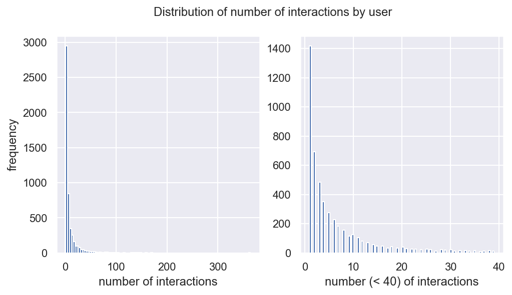
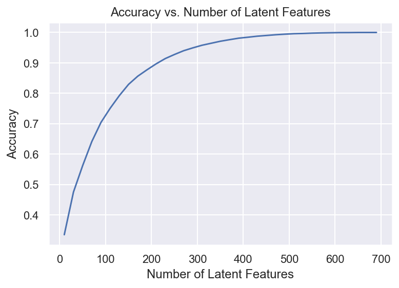
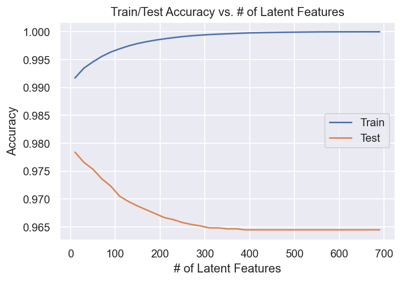

# Recommendations with IBM

In this notebook, you will be putting your recommendation skills to use on real data from the IBM Watson Studio platform. 


You may either submit your notebook through the workspace here, or you may work from your local machine and submit through the next page.  Either way assure that your code passes the project [RUBRIC](Need to update this).  **Please save regularly.**

By following the table of contents, you will build out a number of different methods for making recommendations that can be used for different situations. 


## Table of Contents

I.   [Exploratory Data Analysis](#Exploratory-Data-Analysis)<br>
II.  [Rank Based Recommendations](#Rank)<br>
III. [User-User Based Collaborative Filtering](#User-User)<br>
IV.  [Content Based Recommendations (EXTRA - NOT REQUIRED)](#Content-Recs)<br>
V.   [Matrix Factorization](#Matrix-Fact)<br>
VI.  [Extras & Concluding](#conclusions)

At the end of the notebook, you will find directions for how to submit your work.  Let's get started by importing the necessary libraries and reading in the data.


```python
import pandas as pd
import numpy as np
import matplotlib.pyplot as plt
import project_tests as t
import seaborn as sns
import pickle

from collections import defaultdict
from models import Neighbor

%matplotlib inline
%config InlineBackend.figure_format = 'retina'
sns.set(color_codes=True)

```


```python
df = pd.read_csv('data/user-item-interactions.csv')
df_content = pd.read_csv('data/articles_community.csv')
del df['Unnamed: 0']
del df_content['Unnamed: 0']

# Show df to get an idea of the data
df.head()
```


<div>
<style scoped>
    .dataframe tbody tr th:only-of-type {
        vertical-align: middle;
    }

    .dataframe tbody tr th {
        vertical-align: top;
    }

    .dataframe thead th {
        text-align: right;
    }
</style>
<table border="1" class="dataframe">
  <thead>
    <tr style="text-align: right;">
      <th></th>
      <th>article_id</th>
      <th>title</th>
      <th>email</th>
    </tr>
  </thead>
  <tbody>
    <tr>
      <th>0</th>
      <td>1430.0</td>
      <td>using pixiedust for fast, flexible, and easier...</td>
      <td>ef5f11f77ba020cd36e1105a00ab868bbdbf7fe7</td>
    </tr>
    <tr>
      <th>1</th>
      <td>1314.0</td>
      <td>healthcare python streaming application demo</td>
      <td>083cbdfa93c8444beaa4c5f5e0f5f9198e4f9e0b</td>
    </tr>
    <tr>
      <th>2</th>
      <td>1429.0</td>
      <td>use deep learning for image classification</td>
      <td>b96a4f2e92d8572034b1e9b28f9ac673765cd074</td>
    </tr>
    <tr>
      <th>3</th>
      <td>1338.0</td>
      <td>ml optimization using cognitive assistant</td>
      <td>06485706b34a5c9bf2a0ecdac41daf7e7654ceb7</td>
    </tr>
    <tr>
      <th>4</th>
      <td>1276.0</td>
      <td>deploy your python model as a restful api</td>
      <td>f01220c46fc92c6e6b161b1849de11faacd7ccb2</td>
    </tr>
  </tbody>
</table>
</div>


```python
# Show df_content to get an idea of the data
df_content.head()
```


<div>
<style scoped>
    .dataframe tbody tr th:only-of-type {
        vertical-align: middle;
    }

    .dataframe tbody tr th {
        vertical-align: top;
    }

    .dataframe thead th {
        text-align: right;
    }
</style>
<table border="1" class="dataframe">
  <thead>
    <tr style="text-align: right;">
      <th></th>
      <th>doc_body</th>
      <th>doc_description</th>
      <th>doc_full_name</th>
      <th>doc_status</th>
      <th>article_id</th>
    </tr>
  </thead>
  <tbody>
    <tr>
      <th>0</th>
      <td>Skip navigation Sign in SearchLoading...\r\n\r...</td>
      <td>Detect bad readings in real time using Python ...</td>
      <td>Detect Malfunctioning IoT Sensors with Streami...</td>
      <td>Live</td>
      <td>0</td>
    </tr>
    <tr>
      <th>1</th>
      <td>No Free Hunch Navigation * kaggle.com\r\n\r\n ...</td>
      <td>See the forest, see the trees. Here lies the c...</td>
      <td>Communicating data science: A guide to present...</td>
      <td>Live</td>
      <td>1</td>
    </tr>
    <tr>
      <th>2</th>
      <td>☰ * Login\r\n * Sign Up\r\n\r\n * Learning Pat...</td>
      <td>Here’s this week’s news in Data Science and Bi...</td>
      <td>This Week in Data Science (April 18, 2017)</td>
      <td>Live</td>
      <td>2</td>
    </tr>
    <tr>
      <th>3</th>
      <td>DATALAYER: HIGH THROUGHPUT, LOW LATENCY AT SCA...</td>
      <td>Learn how distributed DBs solve the problem of...</td>
      <td>DataLayer Conference: Boost the performance of...</td>
      <td>Live</td>
      <td>3</td>
    </tr>
    <tr>
      <th>4</th>
      <td>Skip navigation Sign in SearchLoading...\r\n\r...</td>
      <td>This video demonstrates the power of IBM DataS...</td>
      <td>Analyze NY Restaurant data using Spark in DSX</td>
      <td>Live</td>
      <td>4</td>
    </tr>
  </tbody>
</table>
</div>


### <a class="anchor" id="Exploratory-Data-Analysis">Part I : Exploratory Data Analysis</a>

Use the dictionary and cells below to provide some insight into the descriptive statistics of the data.

`1.` What is the distribution of how many articles a user interacts with in the dataset?  Provide a visual and descriptive statistics to assist with giving a look at the number of times each user interacts with an article.  


```python
df_interactions = df.groupby('email').agg({'article_id': 'count'}).reset_index().rename(columns={'article_id': 'interactions'})
df_interactions.sample(10, random_state=42)
```


<div>
<style scoped>
    .dataframe tbody tr th:only-of-type {
        vertical-align: middle;
    }

    .dataframe tbody tr th {
        vertical-align: top;
    }

    .dataframe thead th {
        text-align: right;
    }
</style>
<table border="1" class="dataframe">
  <thead>
    <tr style="text-align: right;">
      <th></th>
      <th>email</th>
      <th>interactions</th>
    </tr>
  </thead>
  <tbody>
    <tr>
      <th>1176</th>
      <td>38d63557c2ba70ceded69d0666dce709e82b7038</td>
      <td>63</td>
    </tr>
    <tr>
      <th>3362</th>
      <td>a5d1c9ef9b5cee841695ead62befc1ac038f6da2</td>
      <td>3</td>
    </tr>
    <tr>
      <th>1090</th>
      <td>34ad4d6149750c1c129cfb93d2724f5f990d7358</td>
      <td>2</td>
    </tr>
    <tr>
      <th>4815</th>
      <td>edf6e416df0c2d1c2419964322af64d75535fa64</td>
      <td>1</td>
    </tr>
    <tr>
      <th>4373</th>
      <td>d7879b4f8154c003a67182c7391f54de1a86b1ad</td>
      <td>12</td>
    </tr>
    <tr>
      <th>279</th>
      <td>0d13bb54cf68fc07d250b6726b1f6b84f9a0cb74</td>
      <td>2</td>
    </tr>
    <tr>
      <th>996</th>
      <td>2fd357f57663747262bc411eb0b21fa8b26332a3</td>
      <td>1</td>
    </tr>
    <tr>
      <th>584</th>
      <td>1be910feb4c727601bd1c3cacaa6a3d4a2c55cc3</td>
      <td>1</td>
    </tr>
    <tr>
      <th>1485</th>
      <td>47414b7dd362d90dc428a139dd4c71e82f4fc6fd</td>
      <td>8</td>
    </tr>
    <tr>
      <th>3922</th>
      <td>c10c55ea873ca4f39e779a2c4673ac8b801b85d8</td>
      <td>1</td>
    </tr>
  </tbody>
</table>
</div>


```python
df_interactions.describe()
```


<div>
<style scoped>
    .dataframe tbody tr th:only-of-type {
        vertical-align: middle;
    }

    .dataframe tbody tr th {
        vertical-align: top;
    }

    .dataframe thead th {
        text-align: right;
    }
</style>
<table border="1" class="dataframe">
  <thead>
    <tr style="text-align: right;">
      <th></th>
      <th>interactions</th>
    </tr>
  </thead>
  <tbody>
    <tr>
      <th>count</th>
      <td>5148.000000</td>
    </tr>
    <tr>
      <th>mean</th>
      <td>8.930847</td>
    </tr>
    <tr>
      <th>std</th>
      <td>16.802267</td>
    </tr>
    <tr>
      <th>min</th>
      <td>1.000000</td>
    </tr>
    <tr>
      <th>25%</th>
      <td>1.000000</td>
    </tr>
    <tr>
      <th>50%</th>
      <td>3.000000</td>
    </tr>
    <tr>
      <th>75%</th>
      <td>9.000000</td>
    </tr>
    <tr>
      <th>max</th>
      <td>364.000000</td>
    </tr>
  </tbody>
</table>
</div>


```python
fig, axes = plt.subplots(1, 2, figsize=(8, 4))

axes[0].hist(x="interactions", data=df_interactions, bins=100)
axes[0].set_xlabel('number of interactions')
axes[0].set_ylabel('frequency')

axes[1].hist(x="interactions", data=df_interactions[df_interactions['interactions'] < 40], bins=100)
axes[1].set_xlabel('number (< 40) of interactions')
axes[0].set_ylabel('frequency')

fig.suptitle('Distribution of number of interactions by user', fontsize=12)

plt.show();
```





```python
# Fill in the median and maximum number of user_article interactios below

median_val = 3 # 50% of individuals interact with 3 number of articles or fewer.
max_views_by_user = 364 # The maximum number of user-article interactions by any 1 user is 364.
```

`2.` Explore and remove duplicate articles from the **df_content** dataframe.  


```python
# Find and explore duplicate articles
df_duplicated = df_content[df_content.duplicated(subset=['article_id'])]
print(f'total rows: {df_content.shape[0]}')
print(f'total unique articles: {df_content["article_id"].unique().shape[0]}')
print(f'total duplicated articles: {df_duplicated.shape[0]}')
df_duplicated
```

    total rows: 1056
    total unique articles: 1051
    total duplicated articles: 5


<div>
<style scoped>
    .dataframe tbody tr th:only-of-type {
        vertical-align: middle;
    }

    .dataframe tbody tr th {
        vertical-align: top;
    }

    .dataframe thead th {
        text-align: right;
    }
</style>
<table border="1" class="dataframe">
  <thead>
    <tr style="text-align: right;">
      <th></th>
      <th>doc_body</th>
      <th>doc_description</th>
      <th>doc_full_name</th>
      <th>doc_status</th>
      <th>article_id</th>
    </tr>
  </thead>
  <tbody>
    <tr>
      <th>365</th>
      <td>Follow Sign in / Sign up Home About Insight Da...</td>
      <td>During the seven-week Insight Data Engineering...</td>
      <td>Graph-based machine learning</td>
      <td>Live</td>
      <td>50</td>
    </tr>
    <tr>
      <th>692</th>
      <td>Homepage Follow Sign in / Sign up Homepage * H...</td>
      <td>One of the earliest documented catalogs was co...</td>
      <td>How smart catalogs can turn the big data flood...</td>
      <td>Live</td>
      <td>221</td>
    </tr>
    <tr>
      <th>761</th>
      <td>Homepage Follow Sign in Get started Homepage *...</td>
      <td>Today’s world of data science leverages data f...</td>
      <td>Using Apache Spark as a parallel processing fr...</td>
      <td>Live</td>
      <td>398</td>
    </tr>
    <tr>
      <th>970</th>
      <td>This video shows you how to construct queries ...</td>
      <td>This video shows you how to construct queries ...</td>
      <td>Use the Primary Index</td>
      <td>Live</td>
      <td>577</td>
    </tr>
    <tr>
      <th>971</th>
      <td>Homepage Follow Sign in Get started * Home\r\n...</td>
      <td>If you are like most data scientists, you are ...</td>
      <td>Self-service data preparation with IBM Data Re...</td>
      <td>Live</td>
      <td>232</td>
    </tr>
  </tbody>
</table>
</div>


```python
# Remove any rows that have the same article_id - only keep the first
df_content = df_content.drop_duplicates(keep='first', subset=['article_id'])
print(f'total rows: {df_content.shape[0]}')
```

    total rows: 1051


`3.` Use the cells below to find:

**a.** The number of unique articles that have an interaction with a user.  
**b.** The number of unique articles in the dataset (whether they have any interactions or not).<br>
**c.** The number of unique users in the dataset. (excluding null values)<br> 
**d.** The number of user-article interactions in the dataset.


```python
unique_articles = df.article_id.unique().shape[0]
total_articles = df_content.article_id.unique().shape[0]
unique_users = df[~df.email.isnull()].email.unique().shape[0]
user_article_interactions =  df.shape[0]
```

`4.` Use the cells below to find the most viewed **article_id**, as well as how often it was viewed.  After talking to the company leaders, the `email_mapper` function was deemed a reasonable way to map users to ids.  There were a small number of null values, and it was find using other information that all of these null values likely belonged to a single user.


```python
df.groupby('article_id')[['email']].count()\
               .sort_values(by='email', ascending=False)\
               .head(1)
```


<div>
<style scoped>
    .dataframe tbody tr th:only-of-type {
        vertical-align: middle;
    }

    .dataframe tbody tr th {
        vertical-align: top;
    }

    .dataframe thead th {
        text-align: right;
    }
</style>
<table border="1" class="dataframe">
  <thead>
    <tr style="text-align: right;">
      <th></th>
      <th>email</th>
    </tr>
    <tr>
      <th>article_id</th>
      <th></th>
    </tr>
  </thead>
  <tbody>
    <tr>
      <th>1429.0</th>
      <td>937</td>
    </tr>
  </tbody>
</table>
</div>


```python
most_viewed_article_id = '1429.0'
max_views = 937
```


```python
## No need to change the code here - this will be helpful for later parts of the notebook
# Run this cell to map the user email to a user_id column and remove the email column

def email_mapper():
    coded_dict = dict()
    cter = 1
    email_encoded = []
    
    for val in df['email']:
        if val not in coded_dict:
            coded_dict[val] = cter
            cter+=1
        
        email_encoded.append(coded_dict[val])
    return email_encoded

email_encoded = email_mapper()
del df['email']
df['user_id'] = email_encoded

# show header
df.head()
```


<div>
<style scoped>
    .dataframe tbody tr th:only-of-type {
        vertical-align: middle;
    }

    .dataframe tbody tr th {
        vertical-align: top;
    }

    .dataframe thead th {
        text-align: right;
    }
</style>
<table border="1" class="dataframe">
  <thead>
    <tr style="text-align: right;">
      <th></th>
      <th>article_id</th>
      <th>title</th>
      <th>user_id</th>
    </tr>
  </thead>
  <tbody>
    <tr>
      <th>0</th>
      <td>1430.0</td>
      <td>using pixiedust for fast, flexible, and easier...</td>
      <td>1</td>
    </tr>
    <tr>
      <th>1</th>
      <td>1314.0</td>
      <td>healthcare python streaming application demo</td>
      <td>2</td>
    </tr>
    <tr>
      <th>2</th>
      <td>1429.0</td>
      <td>use deep learning for image classification</td>
      <td>3</td>
    </tr>
    <tr>
      <th>3</th>
      <td>1338.0</td>
      <td>ml optimization using cognitive assistant</td>
      <td>4</td>
    </tr>
    <tr>
      <th>4</th>
      <td>1276.0</td>
      <td>deploy your python model as a restful api</td>
      <td>5</td>
    </tr>
  </tbody>
</table>
</div>


```python
## If you stored all your results in the variable names above, 
## you shouldn't need to change anything in this cell

sol_1_dict = {
    '`50% of individuals have _____ or fewer interactions.`': median_val,
    '`The total number of user-article interactions in the dataset is ______.`': user_article_interactions,
    '`The maximum number of user-article interactions by any 1 user is ______.`': max_views_by_user,
    '`The most viewed article in the dataset was viewed _____ times.`': max_views,
    '`The article_id of the most viewed article is ______.`': most_viewed_article_id,
    '`The number of unique articles that have at least 1 rating ______.`': unique_articles,
    '`The number of unique users in the dataset is ______`': unique_users,
    '`The number of unique articles on the IBM platform`': total_articles
}

# Test your dictionary against the solution
t.sol_1_test(sol_1_dict)
```

    It looks like you have everything right here! Nice job!


### <a class="anchor" id="Rank">Part II: Rank-Based Recommendations</a> 


Unlike in the earlier lessons, we do not actually have ratings for whether a user liked an article or not.  We only know that a user has interacted with an article.  
In these cases, the popularity of an article can really only be based on how often an article was interacted with.

`1.` Fill in the function below to return the **n** top articles ordered with most interactions as the top. Test your function using the tests below.


```python
def get_top_articles(n, df=df):
    '''
    INPUT:
    n - (int) the number of top articles to return
    df - (pandas dataframe) df as defined at the top of the notebook 
    
    OUTPUT:
    top_articles - (list) A list of the top 'n' article titles 
    
    '''
    top_articles_ids = get_top_article_ids(n, df)
    top_articles = np.array(df[df.article_id.isin(top_articles_ids)]['title'])
    
    return top_articles # Return the top article titles from df (not df_content)

def get_top_article_ids(n, df=df):
    '''
    INPUT:
    n - (int) the number of top articles to return
    df - (pandas dataframe) df as defined at the top of the notebook 
    
    OUTPUT:
    top_articles - (list) A list of the top 'n' article ids 
    '''
    top_articles = np.array(df.groupby('article_id')[['user_id']].count()\
                              .reset_index()\
                              .sort_values(by='user_id', ascending=False)\
                              .head(n)['article_id'])
 
    return [str(r) for r in top_articles] # Return the top article ids
```


```python
print(get_top_articles(10))
print(get_top_article_ids(10))
```

    ['healthcare python streaming application demo'
     'use deep learning for image classification'
     'use deep learning for image classification' ...
     'insights from new york car accident reports'
     'visualize car data with brunel'
     'insights from new york car accident reports']
    ['1429.0', '1330.0', '1431.0', '1427.0', '1364.0', '1314.0', '1293.0', '1170.0', '1162.0', '1304.0']


```python
# Test your function by returning the top 5, 10, and 20 articles
top_5 = get_top_articles(5)
top_10 = get_top_articles(10)
top_20 = get_top_articles(20)

# Test each of your three lists from above
t.sol_2_test(get_top_articles)
```

    Your top_5 looks like the solution list! Nice job.
    Your top_10 looks like the solution list! Nice job.
    Your top_20 looks like the solution list! Nice job.


### <a class="anchor" id="User-User">Part III: User-User Based Collaborative Filtering</a>


`1.` Use the function below to reformat the **df** dataframe to be shaped with users as the rows and articles as the columns.  

* Each **user** should only appear in each **row** once.


* Each **article** should only show up in one **column**.  


* **If a user has interacted with an article, then place a 1 where the user-row meets for that article-column**.  It does not matter how many times a user has interacted with the article, all entries where a user has interacted with an article should be a 1.  


* **If a user has not interacted with an item, then place a zero where the user-row meets for that article-column**. 

Use the tests to make sure the basic structure of your matrix matches what is expected by the solution.


```python
# create the user-article matrix with 1's and 0's

def create_user_item_matrix(df):
    '''
    INPUT:
    df - pandas dataframe with article_id, title, user_id columns
    
    OUTPUT:
    user_item - user item matrix 
    
    Description:
    Return a matrix with user ids as rows and article ids on the columns with 1 values where a user interacted with 
    an article and a 0 otherwise
    '''
    user_articles = df[['user_id', 'article_id']].drop_duplicates(keep='first')
    user_articles['view'] = 1   

    user_item = user_articles.groupby(['user_id', 'article_id'])['view'].max().unstack().fillna(0)
    
    return user_item # return the user_item matrix 

user_item = create_user_item_matrix(df)
```


```python
pickle.dump( user_item, open( "user_item_matrix.p", "wb" ) )
```


```python
## Tests: You should just need to run this cell.  Don't change the code.
assert user_item.shape[0] == 5149, "Oops!  The number of users in the user-article matrix doesn't look right."
assert user_item.shape[1] == 714, "Oops!  The number of articles in the user-article matrix doesn't look right."
assert user_item.sum(axis=1)[1] == 36, "Oops!  The number of articles seen by user 1 doesn't look right."
print("You have passed our quick tests!  Please proceed!")
```

    You have passed our quick tests!  Please proceed!


`2.` Complete the function below which should take a user_id and provide an ordered list of the most similar users to that user (from most similar to least similar).  The returned result should not contain the provided user_id, as we know that each user is similar to him/herself. Because the results for each user here are binary, it (perhaps) makes sense to compute similarity as the dot product of two users. 

Use the tests to test your function.


```python

def find_nearest_neighbors(user_id, user_item=user_item):
    '''
    INPUT:
    user_id - (int) a user_id
    user_item - (pandas dataframe) matrix of users by articles: 
                1's when a user has interacted with an article, 0 otherwise
    
    OUTPUT:
    nearest_neighbors - (list) an ordered list where the closest users (largest dot product users) are listed first
    
    Description:
    Computes the similarity of every pair of users based on the dot product
    Returns an ordered objects
    
    '''
    user_articles = user_item.loc[user_id, :].values
    most_similar_users = []

    for neighbor_id, row in user_item.iterrows():
        if user_id != neighbor_id:
            neighbor_articles = np.array(row.values)
            score = np.dot(user_articles, neighbor_articles)

            most_similar_users.append(Neighbor(neighbor_id, score))

    most_similar_users = sorted(most_similar_users, reverse=True)
       
    return most_similar_users
    

def find_similar_users(user_id, user_item=user_item):
    '''
    INPUT:
    user_id - (int) a user_id
    user_item - (pandas dataframe) matrix of users by articles: 
                1's when a user has interacted with an article, 0 otherwise
    
    OUTPUT:
    similar_users - (list) an ordered list where the closest user ids(largest dot product users)
                    are listed first
    
    Description:
    Computes the similarity of every pair of users based on the dot product
    Returns an ordered ids
    
    '''
    most_similar_users = find_nearest_neighbors(user_id, user_item)
    most_similar_user_ids = list(map(lambda x: x.user_id, most_similar_users))
       
    return most_similar_user_ids
        
```


```python
# Do a spot check of your function
print("The 10 most similar users to user 1 are: {}".format(find_similar_users(1)[:10]))
print("The 5 most similar users to user 3933 are: {}".format(find_similar_users(3933)[:5]))
print("The 3 most similar users to user 46 are: {}".format(find_similar_users(46)[:3]))
```

    The 10 most similar users to user 1 are: [3933, 23, 3782, 203, 4459, 131, 3870, 46, 4201, 49]
    The 5 most similar users to user 3933 are: [1, 23, 3782, 203, 4459]
    The 3 most similar users to user 46 are: [4201, 23, 3782]


`3.` Now that you have a function that provides the most similar users to each user, you will want to use these users to find articles you can recommend.  Complete the functions below to return the articles you would recommend to each user. 


```python
def get_article_names(article_ids, df=df):
    '''
    INPUT:
    article_ids - (list) a list of article ids
    df - (pandas dataframe) df as defined at the top of the notebook
    
    OUTPUT:
    article_names - (list) a list of article names associated with the list of article ids 
                    (this is identified by the title column)
    '''
    article_names = np.array(df[df.article_id.isin(article_ids)]['title'].unique())
    
    return article_names


def get_user_articles(user_id, user_item=user_item):
    '''
    INPUT:
    user_id - (int) a user id
    user_item - (pandas dataframe) matrix of users by articles: 
                1's when a user has interacted with an article, 0 otherwise
    
    OUTPUT:
    article_ids - (list) a list of the article ids seen by the user
    article_names - (list) a list of article names associated with the list of article ids 
    
    Description:
    Provides a list of the article_ids and article titles that have been seen by a user
    '''
    article_ids = user_item.loc[user_id][user_item.loc[user_id] == 1].index.values.astype(str)
    article_names = get_article_names(article_ids, df)
    
    return article_ids, article_names


def user_user_recs(user_id, m=10):
    '''
    INPUT:
    user_id - (int) a user id
    m - (int) the number of recommendations you want for the user
    
    OUTPUT:
    recs - (list) a list of recommendations for the user
    
    Description:
    Loops through the users based on closeness to the input user_id
    For each user - finds articles the user hasn't seen before and provides them as recs
    Does this until m recommendations are found
    
    Notes:
    Users who are the same closeness are chosen arbitrarily as the 'next' user
    
    For the user where the number of recommended articles starts below m 
    and ends exceeding m, the last items are chosen arbitrarily
    
    '''
    rec_ids = np.array([])

    nearest_neighbors = find_similar_users(user_id)
    user_article_ids, user_article_names = get_user_articles(user_id, user_item)

    for neighbor_id in nearest_neighbors:
        neighbor_article_ids, neighbor_article_names = get_user_articles(neighbor_id, user_item)
        neighbor_recs = np.setdiff1d(neighbor_article_ids, user_article_ids)

        new_neighbor_recs = np.setdiff1d(neighbor_recs, rec_ids)
        rec_ids = np.concatenate((rec_ids, new_neighbor_recs), axis=None)    

        if len(rec_ids) >= m:
            break
    
    return rec_ids[:m].astype(float)
```


```python
# Check Results
get_article_names(user_user_recs(1, 10)) # Return 10 recommendations for user 1
```


    array(['analyze energy consumption in buildings',
           'analyze accident reports on amazon emr spark',
           '520    using notebooks with pixiedust for fast, flexi...\nName: title, dtype: object',
           '1448    i ranked every intro to data science course on...\nName: title, dtype: object',
           'data tidying in data science experience',
           'airbnb data for analytics: vancouver listings',
           'recommender systems: approaches & algorithms',
           'airbnb data for analytics: mallorca reviews',
           'analyze facebook data using ibm watson and watson studio',
           'a tensorflow regression model to predict house values'],
          dtype=object)


```python
# Test your functions here - No need to change this code - just run this cell
assert set(get_article_names(['1024.0', '1176.0', '1305.0', '1314.0', '1422.0', '1427.0'])) == set(['using deep learning to reconstruct high-resolution audio', 'build a python app on the streaming analytics service', 'gosales transactions for naive bayes model', 'healthcare python streaming application demo', 'use r dataframes & ibm watson natural language understanding', 'use xgboost, scikit-learn & ibm watson machine learning apis']), "Oops! Your the get_article_names function doesn't work quite how we expect."
assert set(get_article_names(['1320.0', '232.0', '844.0'])) == set(['housing (2015): united states demographic measures','self-service data preparation with ibm data refinery','use the cloudant-spark connector in python notebook']), "Oops! Your the get_article_names function doesn't work quite how we expect."
assert set(get_user_articles(20)[0]) == set(['1320.0', '232.0', '844.0'])
assert set(get_user_articles(20)[1]) == set(['housing (2015): united states demographic measures', 'self-service data preparation with ibm data refinery','use the cloudant-spark connector in python notebook'])
assert set(get_user_articles(2)[0]) == set(['1024.0', '1176.0', '1305.0', '1314.0', '1422.0', '1427.0'])
assert set(get_user_articles(2)[1]) == set(['using deep learning to reconstruct high-resolution audio', 'build a python app on the streaming analytics service', 'gosales transactions for naive bayes model', 'healthcare python streaming application demo', 'use r dataframes & ibm watson natural language understanding', 'use xgboost, scikit-learn & ibm watson machine learning apis'])
print("If this is all you see, you passed all of our tests!  Nice job!")
```

    If this is all you see, you passed all of our tests!  Nice job!


`4.` Now we are going to improve the consistency of the **user_user_recs** function from above.  

* Instead of arbitrarily choosing when we obtain users who are all the same closeness to a given user - choose the users that have the most total article interactions before choosing those with fewer article interactions.


* Instead of arbitrarily choosing articles from the user where the number of recommended articles starts below m and ends exceeding m, choose articles with the articles with the most total interactions before choosing those with fewer total interactions. This ranking should be  what would be obtained from the **top_articles** function you wrote earlier.


```python
def get_top_sorted_users(user_id, df=df, user_item=user_item):
    '''
    INPUT:
    user_id - (int)
    df - (pandas dataframe) df as defined at the top of the notebook 
    user_item - (pandas dataframe) matrix of users by articles: 
            1's when a user has interacted with an article, 0 otherwise
    
            
    OUTPUT:
    neighbors_df - (pandas dataframe) a dataframe with:
                    neighbor_id - is a neighbor user_id
                    similarity - measure of the similarity of each user to the provided user_id
                    num_interactions - the number of articles viewed by the user - if a u
                    
    Other Details - sort the neighbors_df by the similarity and then by number of interactions where 
                    highest of each is higher in the dataframe
     
    '''

    neighbors = find_nearest_neighbors(user_id, user_item)
    neighbors_df = pd.DataFrame([x.to_dict() for x in neighbors])

    # adding interactions
    neighbors_df = neighbors_df.merge(df, on=['user_id'])\
                               .groupby('user_id')\
                               .agg({'article_id': 'count', 'score': 'max'})\
                               .reset_index()\
                               .rename(columns={'article_id': 'interactions'})\
                               .sort_values(by=['score', 'interactions'], ascending=False)

    return neighbors_df # Return the dataframe specified in the doc_string


def user_user_recs_part2(user_id, m=10):
    '''
    INPUT:
    user_id - (int) a user id
    m - (int) the number of recommendations you want for the user
    
    OUTPUT:
    recs - (list) a list of recommendations for the user by article id
    rec_names - (list) a list of recommendations for the user by article title
    
    Description:
    Loops through the users based on closeness to the input user_id
    For each user - finds articles the user hasn't seen before and provides them as recs
    Does this until m recommendations are found
    
    Notes:
    * Choose the users that have the most total article interactions 
    before choosing those with fewer article interactions.

    * Choose articles with the articles with the most total interactions 
    before choosing those with fewer total interactions. 
   
    '''
    top_neighbors_df = get_top_sorted_users(user_id, df, user_item)
    user_article_ids, user_article_names = get_user_articles(user_id, user_item)
    rec_ids = np.array([])

    for idx, row in top_neighbors_df.iterrows():
        neighbor_article_ids, neighbor_article_names = get_user_articles(row['user_id'], user_item)
        neighbor_recs = np.setdiff1d(neighbor_article_ids, user_article_ids)

        sorted_neighbor_recs = get_top_article_ids(m, df[df.article_id.isin(neighbor_recs)])

        new_neighbor_recs = np.setdiff1d(sorted_neighbor_recs, rec_ids)
        rec_ids = np.concatenate((rec_ids, new_neighbor_recs), axis=None)    

        if len(rec_ids) >= m:
            break
    
    rec_ids = rec_ids[:m]
    rec_names = get_article_names(rec_ids)
    
    return rec_ids, rec_names
```


```python
get_top_sorted_users(1, df=df, user_item=user_item).head()
```


<div>
<style scoped>
    .dataframe tbody tr th:only-of-type {
        vertical-align: middle;
    }

    .dataframe tbody tr th {
        vertical-align: top;
    }

    .dataframe thead th {
        text-align: right;
    }
</style>
<table border="1" class="dataframe">
  <thead>
    <tr style="text-align: right;">
      <th></th>
      <th>user_id</th>
      <th>interactions</th>
      <th>score</th>
    </tr>
  </thead>
  <tbody>
    <tr>
      <th>3931</th>
      <td>3933</td>
      <td>45</td>
      <td>35.0</td>
    </tr>
    <tr>
      <th>21</th>
      <td>23</td>
      <td>364</td>
      <td>17.0</td>
    </tr>
    <tr>
      <th>3780</th>
      <td>3782</td>
      <td>363</td>
      <td>17.0</td>
    </tr>
    <tr>
      <th>201</th>
      <td>203</td>
      <td>160</td>
      <td>15.0</td>
    </tr>
    <tr>
      <th>4457</th>
      <td>4459</td>
      <td>158</td>
      <td>15.0</td>
    </tr>
  </tbody>
</table>
</div>


```python
# Quick spot check - don't change this code - just use it to test your functions
rec_ids, rec_names = user_user_recs_part2(20, 10)
print("The top 10 recommendations for user 20 are the following article ids:")
print(rec_ids)
print()
print("The top 10 recommendations for user 20 are the following article names:")
print(rec_names)
```

    The top 10 recommendations for user 20 are the following article ids:
    ['1160.0' '1162.0' '1170.0' '1304.0' '1330.0' '1351.0' '1354.0' '1364.0'
     '1368.0' '1427.0']
    
    The top 10 recommendations for user 20 are the following article names:
    ['apache spark lab, part 1: basic concepts'
     'predicting churn with the spss random tree algorithm'
     'analyze energy consumption in buildings'
     'use xgboost, scikit-learn & ibm watson machine learning apis'
     'putting a human face on machine learning'
     'gosales transactions for logistic regression model'
     'insights from new york car accident reports'
     'model bike sharing data with spss'
     'analyze accident reports on amazon emr spark'
     'movie recommender system with spark machine learning']


`5.` Use your functions from above to correctly fill in the solutions to the dictionary below.  Then test your dictionary against the solution.  Provide the code you need to answer each following the comments below.


```python
### Tests with a dictionary of results

user1_most_sim = get_top_sorted_users(1, df=df, user_item=user_item).head(1)['user_id'].values[0]
user131_10th_sim = get_top_sorted_users(131, df=df, user_item=user_item).head(10)['user_id'].values[9]
```


```python
## Dictionary Test Here
sol_5_dict = {
    'The user that is most similar to user 1.': user1_most_sim, 
    'The user that is the 10th most similar to user 131': user131_10th_sim,
}

t.sol_5_test(sol_5_dict)
```

    This all looks good!  Nice job!


`6.` If we were given a new user, which of the above functions would you be able to use to make recommendations?  Explain.  Can you think of a better way we might make recommendations?  Use the cell below to explain a better method for new users.

- ** Collaborative filtering approches such as `user_user_recs` and `user_user_recs_part2` will not generate recommendations as the new user won't be in user-item matrix**

- ** Only the rank based approach would be able to generate recommendations. In this case, we can call the function `get_top_article_ids` and generate recommendations to the new user. However, it is important to highligth that these recommendations will not be personalized. Each new user will receive the same top article recommendations.**

- ** A possible way to minimize this cold start problem is to recommend the top articles from the top n users (user sorted by interactions). To avoid generating the same recommendations for each new user, we can randomize (draw) the list of top articles from these top n users. ** 

`7.` Using your existing functions, provide the top 10 recommended articles you would provide for the a new user below.  You can test your function against our thoughts to make sure we are all on the same page with how we might make a recommendation.


```python
new_user = '0.0'

# What would your recommendations be for this new user '0.0'?  As a new user, they have no observed articles.
# Provide a list of the top 10 article ids you would give to 
new_user_recs = get_top_article_ids(10, df)

```


```python
assert set(new_user_recs) == set(['1314.0','1429.0','1293.0','1427.0','1162.0','1364.0','1304.0','1170.0','1431.0','1330.0']), "Oops!  It makes sense that in this case we would want to recommend the most popular articles, because we don't know anything about these users."

print("That's right!  Nice job!")
```

    That's right!  Nice job!


### <a class="anchor" id="Content-Recs">Part IV: Content Based Recommendations</a>

Another method we might use to make recommendations is to perform a ranking of the highest ranked articles associated with some term.  You might consider content to be the **doc_body**, **doc_description**, or **doc_full_name**.  There is not one way to create a content based recommendation, especially considering that each of these columns hold content related information.  


`1.` Use the function body below to create a content based recommender.  Since there isn't one right answer for this recommendation tactic, no test functions are provided.  Feel free to change the function inputs if you decide you want to try a method that requires more input values.  The input values are currently set with one idea in mind that you may use to make content based recommendations.  One additional idea is that you might want to choose the most popular recommendations that meet your 'content criteria', but again, there is a lot of flexibility in how you might make these recommendations.

I've implemented a content-base recommenders using dot2vec gensin model. My approach is based on this [post](https://medium.com/@mishra.thedeepak/doc2vec-simple-implementation-example-df2afbbfbad5). 

All code for traing and predicting can be found in `article2vec.py`. For a given article ide, my approach recommends similar article ids based their embeddings. I've created a function called `get_article_recs` to generate these recommendations.

### Training article2vec model


```python
# Preparing data
# Using `doc_full_name` when available, otherwise, title is used
train_df = df[['article_id', 'title']].drop_duplicates(keep='first')
train_df = train_df.merge(df_content[['article_id', 'doc_full_name']], on=['article_id'], how='left')
train_df['doc_full_name'] = train_df.apply(lambda r: r['doc_full_name'] if not pd.isnull(r['doc_full_name']) else r['title'], axis=1)
train_df.drop('title', axis=1, inplace=True)
```


```python
%%time 
from article2vec import Article2vec

model = Article2vec(epochs=100)
model.fit(train_df)
model.save()
```

    epoch 0
    epoch 1
    epoch 2
    epoch 3
    epoch 4
    epoch 5
    epoch 6
    epoch 7
    epoch 8
    epoch 9
    epoch 10
    epoch 11
    epoch 12
    epoch 13
    epoch 14
    epoch 15
    epoch 16
    epoch 17
    epoch 18
    epoch 19
    epoch 20
    epoch 21
    epoch 22
    epoch 23
    epoch 24
    epoch 25
    epoch 26
    epoch 27
    epoch 28
    epoch 29
    epoch 30
    epoch 31
    epoch 32
    epoch 33
    epoch 34
    epoch 35
    epoch 36
    epoch 37
    epoch 38
    epoch 39
    epoch 40
    epoch 41
    epoch 42
    epoch 43
    epoch 44
    epoch 45
    epoch 46
    epoch 47
    epoch 48
    epoch 49
    epoch 50
    epoch 51
    epoch 52
    epoch 53
    epoch 54
    epoch 55
    epoch 56
    epoch 57
    epoch 58
    epoch 59
    epoch 60
    epoch 61
    epoch 62
    epoch 63
    epoch 64
    epoch 65
    epoch 66
    epoch 67
    epoch 68
    epoch 69
    epoch 70
    epoch 71
    epoch 72
    epoch 73
    epoch 74
    epoch 75
    epoch 76
    epoch 77
    epoch 78
    epoch 79
    epoch 80
    epoch 81
    epoch 82
    epoch 83
    epoch 84
    epoch 85
    epoch 86
    epoch 87
    epoch 88
    epoch 89
    epoch 90
    epoch 91
    epoch 92
    epoch 93
    epoch 94
    epoch 95
    epoch 96
    epoch 97
    epoch 98
    epoch 99
    CPU times: user 13.4 s, sys: 358 ms, total: 13.7 s
    Wall time: 13.7 s


### Function to evaluate and generate recommendations


```python
def get_article_recs(article_id, m=5):
    '''
    INPUT:
    article_id - an article id
    m - number of recommendations
    
    OUTPUT:
    article_names - (list) a list of article names associated with the list of article ids 
                    (this is identified by the title column)
    '''
    recs = model.recommend(str(article_id))[:m]
    article_names = []

    for rec in recs:
        article_names.append(train_df[train_df.article_id == float(rec[0])][["doc_full_name"]].values[0][0])
    
    return article_names


def evaluate_sample_recs(sample_size=10, m=5):
    '''
    INPUT:
    sample_size - (int) number of radom article ids will sampled for evaluation
    m - number of recommendations for each sampled article
    
    OUTPUT:
    None - displays recommendations (id, name, score) for each sampled article id
    '''
    sample_articles = train_df.sample(sample_size, random_state=42)

    for idx, row in sample_articles.iterrows():
        print(f'{row["article_id"]} - {row["doc_full_name"]}')
        print('recs:')
        article2vec_recs = model.recommend(str(row["article_id"]))[:m]
        display_article2vec_recs(article2vec_recs)
        print('---------------------------------------')


def display_article2vec_recs(rec_data):
    '''
    INPUT:
    rec_data - (list) model's outupue
    
    OUTPUT:
    None - displays recommendations (id, name, score) for each sampled article id
    '''
    for rec in rec_data:
        print(f'\t{rec[0]}: {train_df[train_df.article_id == float(rec[0])][["doc_full_name"]].values[0][0]} ({round(rec[1], 3)})')
```


```python
# Evaluating a sample of article ids
evaluate_sample_recs(10)
```

    373.0 - Working with notebooks in DSX
    recs:
    	323.0: Manage Object Storage in DSX (0.846)
    	20.0: Working interactively with RStudio and notebooks in DSX (0.786)
    	634.0: Working with Db2 Warehouse on Cloud in Data Science Experience (0.754)
    	972.0: Create a project in DSX (0.74)
    	757.0: Working with on-premises databases — Step by Step (0.727)
    ---------------------------------------
    16.0 - Higher-order Logistic Regression for Large Datasets
    recs:
    	1304.0: gosales transactions for logistic regression model (0.886)
    	1360.0: pixieapp for outlier detection (0.78)
    	781.0: Empirical Bayes for multiple sample sizes (0.773)
    	585.0: Tidyverse practice: mapping large European cities (0.767)
    	1296.0: fortune 100 companies (0.738)
    ---------------------------------------
    1279.0 - dry bulb temperature, by country, station and year
    recs:
    	1358.0: part-time employment rate, worldwide, by country and year (0.876)
    	356.0: Deep Learning, Structure and Innate Priors (0.805)
    	1377.0: roads paved as % of total roads by country (0.79)
    	1443.0: worldwide electricity demand and production 1990-2012 (0.781)
    	1371.0: refugees (0.775)
    ---------------------------------------
    1187.0 - consumer prices
    recs:
    	256.0: xml2 1.0.0 (0.933)
    	749.0: Hurricane How-To (0.912)
    	60.0: readr 1.0.0 (0.908)
    	1183.0: categorize urban density (0.901)
    	324.0: MyCheatSheets.com (0.891)
    ---------------------------------------
    1227.0 - country statistics: industrial production growth rate
    recs:
    	1263.0: country statistics: unemployment rate (0.902)
    	1228.0: country statistics: infant mortality rate (0.895)
    	1234.0: country statistics: maternal mortality rate (0.892)
    	1198.0: country statistics: commercial bank prime lending rate (0.875)
    	1196.0: country statistics: central bank discount rate (0.875)
    ---------------------------------------
    935.0 - Making data cleaning simple with the Sparkling.data library
    recs:
    	1432.0: visualize data with the matplotlib library (0.84)
    	1394.0: the nurse assignment problem data (0.731)
    	1433.0: visualize the 1854 london cholera outbreak (0.71)
    	1017.0: The pandas Data Analysis Library (0.698)
    	131.0: Simple Graphing with IPython and Pandas (0.688)
    ---------------------------------------
    1157.0 - airbnb data for analytics: washington d.c. listings
    recs:
    	1158.0: airbnb data for analytics: washington d.c. reviews (0.956)
    	1156.0: airbnb data for analytics: washington d.c. calendar (0.949)
    	1145.0: airbnb data for analytics: trentino listings (0.947)
    	1064.0: airbnb data for analytics: antwerp listings test (0.945)
    	1148.0: airbnb data for analytics: vancouver listings (0.936)
    ---------------------------------------
    426.0 - Migrating to Python 3 with pleasure
    recs:
    	1052.0: access db2 warehouse on cloud and db2 with python (0.747)
    	542.0: Getting started with Python (0.694)
    	1424.0: use spark for python to load data and run sql queries (0.686)
    	1053.0: access mysql with python (0.668)
    	1055.0: access postgresql with python (0.664)
    ---------------------------------------
    270.0 - Learning Statistics on Youtube
    recs:
    	1368.0: putting a human face on machine learning (0.82)
    	1232.0: country statistics: life expectancy at birth (0.779)
    	1230.0: country statistics: internet users (0.765)
    	1253.0: country statistics: roadways (0.765)
    	846.0: Pearson correlation aggregation on SparkSQL (0.751)
    ---------------------------------------
    1273.0 - customers of a telco including services used
    recs:
    	1180.0: calls by customers of a telco company (0.907)
    	758.0: A glimpse inside the mind of a data scientist (0.835)
    	566.0: The t-distribution: a key statistical concept discovered by a beer brewery (0.825)
    	485.0: A Moving Average Trading Strategy (0.754)
    	722.0: Visual Information Theory  (0.745)
    ---------------------------------------


`2.` Now that you have put together your content-based recommendation system, use the cell below to write a summary explaining how your content based recommender works.  Do you see any possible improvements that could be made to your function?  Is there anything novel about your content based recommender?


My recommnender consumes Article2vec model which internally probably does the following operations:

1. Generate embedding representation (vector representation) for the seed article  
2. Calculate the distance of this vector (step 1) against closest vectors (other articles)
3. Recommend n closest articles

`3.` Use your content-recommendation system to make recommendations for the below scenarios based on the comments.  Again no tests are provided here, because there isn't one right answer that could be used to find these content based recommendations.


```python
# make recommendations for a brand new user
top_article = get_top_article_ids(1, df=df)[0]
get_article_recs(top_article)
```


    ['A guide to convolution arithmetic for deep learning',
     'A Classification Problem',
     'Deep Learning, Structure and Innate Priors',
     'use apache systemml and spark for machine learning',
     'Awesome deep learning papers']


```python
# make a recommendations for a user who only has interacted with article id '1427.0'
get_article_recs('1427.0')
```


    ["Hugo Larochelle's neural network & deep learning tutorial videos, subtitled & screengrabbed",
     'from local spark mllib model to cloud with watson machine learning',
     'use r dataframes & ibm watson natural language understanding',
     'Watson Machine Learning for Developers',
     'Introducing IBM Watson Studio ']


### <a class="anchor" id="Matrix-Fact">Part V: Matrix Factorization</a>

In this part of the notebook, you will build use matrix factorization to make article recommendations to the users on the IBM Watson Studio platform.

`1.` You should have already created a **user_item** matrix above in **question 1** of **Part III** above.  This first question here will just require that you run the cells to get things set up for the rest of **Part V** of the notebook. 


```python
# Load the matrix here
user_item_matrix = pd.read_pickle('user_item_matrix.p')
```


```python
# quick look at the matrix
user_item_matrix.head()
```


<div>
<style scoped>
    .dataframe tbody tr th:only-of-type {
        vertical-align: middle;
    }

    .dataframe tbody tr th {
        vertical-align: top;
    }

    .dataframe thead th {
        text-align: right;
    }
</style>
<table border="1" class="dataframe">
  <thead>
    <tr style="text-align: right;">
      <th>article_id</th>
      <th>0.0</th>
      <th>2.0</th>
      <th>4.0</th>
      <th>8.0</th>
      <th>9.0</th>
      <th>12.0</th>
      <th>14.0</th>
      <th>15.0</th>
      <th>16.0</th>
      <th>18.0</th>
      <th>...</th>
      <th>1434.0</th>
      <th>1435.0</th>
      <th>1436.0</th>
      <th>1437.0</th>
      <th>1439.0</th>
      <th>1440.0</th>
      <th>1441.0</th>
      <th>1442.0</th>
      <th>1443.0</th>
      <th>1444.0</th>
    </tr>
    <tr>
      <th>user_id</th>
      <th></th>
      <th></th>
      <th></th>
      <th></th>
      <th></th>
      <th></th>
      <th></th>
      <th></th>
      <th></th>
      <th></th>
      <th></th>
      <th></th>
      <th></th>
      <th></th>
      <th></th>
      <th></th>
      <th></th>
      <th></th>
      <th></th>
      <th></th>
      <th></th>
    </tr>
  </thead>
  <tbody>
    <tr>
      <th>1</th>
      <td>0.0</td>
      <td>0.0</td>
      <td>0.0</td>
      <td>0.0</td>
      <td>0.0</td>
      <td>0.0</td>
      <td>0.0</td>
      <td>0.0</td>
      <td>0.0</td>
      <td>0.0</td>
      <td>...</td>
      <td>0.0</td>
      <td>0.0</td>
      <td>1.0</td>
      <td>0.0</td>
      <td>1.0</td>
      <td>0.0</td>
      <td>0.0</td>
      <td>0.0</td>
      <td>0.0</td>
      <td>0.0</td>
    </tr>
    <tr>
      <th>2</th>
      <td>0.0</td>
      <td>0.0</td>
      <td>0.0</td>
      <td>0.0</td>
      <td>0.0</td>
      <td>0.0</td>
      <td>0.0</td>
      <td>0.0</td>
      <td>0.0</td>
      <td>0.0</td>
      <td>...</td>
      <td>0.0</td>
      <td>0.0</td>
      <td>0.0</td>
      <td>0.0</td>
      <td>0.0</td>
      <td>0.0</td>
      <td>0.0</td>
      <td>0.0</td>
      <td>0.0</td>
      <td>0.0</td>
    </tr>
    <tr>
      <th>3</th>
      <td>0.0</td>
      <td>0.0</td>
      <td>0.0</td>
      <td>0.0</td>
      <td>0.0</td>
      <td>1.0</td>
      <td>0.0</td>
      <td>0.0</td>
      <td>0.0</td>
      <td>0.0</td>
      <td>...</td>
      <td>0.0</td>
      <td>0.0</td>
      <td>1.0</td>
      <td>0.0</td>
      <td>0.0</td>
      <td>0.0</td>
      <td>0.0</td>
      <td>0.0</td>
      <td>0.0</td>
      <td>0.0</td>
    </tr>
    <tr>
      <th>4</th>
      <td>0.0</td>
      <td>0.0</td>
      <td>0.0</td>
      <td>0.0</td>
      <td>0.0</td>
      <td>0.0</td>
      <td>0.0</td>
      <td>0.0</td>
      <td>0.0</td>
      <td>0.0</td>
      <td>...</td>
      <td>0.0</td>
      <td>0.0</td>
      <td>0.0</td>
      <td>0.0</td>
      <td>0.0</td>
      <td>0.0</td>
      <td>0.0</td>
      <td>0.0</td>
      <td>0.0</td>
      <td>0.0</td>
    </tr>
    <tr>
      <th>5</th>
      <td>0.0</td>
      <td>0.0</td>
      <td>0.0</td>
      <td>0.0</td>
      <td>0.0</td>
      <td>0.0</td>
      <td>0.0</td>
      <td>0.0</td>
      <td>0.0</td>
      <td>0.0</td>
      <td>...</td>
      <td>0.0</td>
      <td>0.0</td>
      <td>0.0</td>
      <td>0.0</td>
      <td>0.0</td>
      <td>0.0</td>
      <td>0.0</td>
      <td>0.0</td>
      <td>0.0</td>
      <td>0.0</td>
    </tr>
  </tbody>
</table>
<p>5 rows × 714 columns</p>
</div>


`2.` In this situation, you can use Singular Value Decomposition from [numpy](https://docs.scipy.org/doc/numpy-1.14.0/reference/generated/numpy.linalg.svd.html) on the user-item matrix.  Use the cell to perfrom SVD, and explain why this is different than in the lesson.


```python
# Perform SVD on the User-Item Matrix Here

u, s, vt = np.linalg.svd(user_item_matrix)
u.shape, s.shape, vt.shape
```


    ((5149, 5149), (714,), (714, 714))


**In general, the main differences from the lesson are:**

- In this project we are not predicting ratings but values between 0 and 1
- We don't have missing values, so we don't need to use FunkSVD for example. We can use this matrix directly 

`3.` Now for the tricky part, how do we choose the number of latent features to use?  Running the below cell, you can see that as the number of latent features increases, we obtain a lower error rate on making predictions for the 1 and 0 values in the user-item matrix.  Run the cell below to get an idea of how the accuracy improves as we increase the number of latent features.


```python
num_latent_feats = np.arange(10,700+10,20)
sum_errs = []

for k in num_latent_feats:
    # restructure with k latent features
    s_new, u_new, vt_new = np.diag(s[:k]), u[:, :k], vt[:k, :]
    
    # take dot product
    user_item_est = np.around(np.dot(np.dot(u_new, s_new), vt_new))
    
    # compute error for each prediction to actual value
    diffs = np.subtract(user_item_matrix, user_item_est)
    
    # total errors and keep track of them
    err = np.sum(np.sum(np.abs(diffs)))
    sum_errs.append(err)
    
    
plt.plot(num_latent_feats, 1 - np.array(sum_errs)/df.shape[0]);
plt.xlabel('Number of Latent Features');
plt.ylabel('Accuracy');
plt.title('Accuracy vs. Number of Latent Features');
```





`4.` From the above, we can't really be sure how many features to use, because simply having a better way to predict the 1's and 0's of the matrix doesn't exactly give us an indication of if we are able to make good recommendations.  Instead, we might split our dataset into a training and test set of data, as shown in the cell below.  

Use the code from question 3 to understand the impact on accuracy of the training and test sets of data with different numbers of latent features. Using the split below: 

* How many users can we make predictions for in the test set?  
* How many users are we not able to make predictions for because of the cold start problem?
* How many articles can we make predictions for in the test set?  
* How many articles are we not able to make predictions for because of the cold start problem?


```python
df_train = df.head(40000)
df_test = df.tail(5993)

def create_test_and_train_user_item(df_train, df_test):
    '''
    INPUT:
    df_train - training dataframe
    df_test - test dataframe
    
    OUTPUT:
    user_item_train - a user-item matrix of the training dataframe 
                      (unique users for each row and unique articles for each column)
    user_item_test - a user-item matrix of the testing dataframe 
                    (unique users for each row and unique articles for each column)
    test_idx - all of the test user ids
    test_arts - all of the test article ids
    
    '''
    user_item_train = create_user_item_matrix(df_train)
    user_item_test = create_user_item_matrix(df_test)

    test_idx = np.array(user_item_test.index)
    test_arts = np.array(user_item_test.columns)

    return user_item_train, user_item_test, test_idx, test_arts

user_item_train, user_item_test, test_idx, test_arts = create_test_and_train_user_item(df_train, df_test)
```


```python
intersect_users = len(np.intersect1d(np.array(user_item_train.index), test_idx))
intersect_articles = len(np.intersect1d(np.array(user_item_train.columns), test_arts))
test_users = len(test_idx)
test_articles = len(test_arts)

print(f'users with predictions: {intersect_users}')
print(f'cold start afected users: {test_users - intersect_users}')
print(f'articles with predictions: {intersect_articles}')
print(f'cold start afected items: {test_articles - intersect_articles}')
```

    users with predictions: 20
    cold start afected users: 662
    articles with predictions: 574
    cold start afected items: 0


```python
# Replace the values in the dictionary below
a = 662 
b = 574 
c = 20 
d = 0 


sol_4_dict = {
    'How many users can we make predictions for in the test set?': c, 
    'How many users in the test set are we not able to make predictions for because of the cold start problem?': a, 
    'How many articles can we make predictions for in the test set?': b,
    'How many articles in the test set are we not able to make predictions for because of the cold start problem?': d
}

t.sol_4_test(sol_4_dict)
```

    Awesome job!  That's right!  All of the test articles are in the training data, but there are only 20 test users that were also in the training set.  All of the other users that are in the test set we have no data on.  Therefore, we cannot make predictions for these users using SVD.


`5.` Now use the **user_item_train** dataset from above to find **U**, **S**, and **V** transpose using SVD. Then find the subset of rows in the **user_item_test** dataset that you can predict using this matrix decomposition with different numbers of latent features to see how many features makes sense to keep based on the accuracy on the test data. This will require combining what was done in questions `2` - `4`.

Use the cells below to explore how well SVD works towards making predictions for recommendations on the test data.  


```python
# fit SVD on the user_item_train matrix
u_train, s_train, vt_train = np.linalg.svd(user_item_train)
```


```python
def train_and_validate():
    num_latent_feats = np.arange(10,700+10,20)
    sum_errs_train, sum_errs_test, all_errors = [], [], []

    ##  Test set users
    test_idx = user_item_test.index
    user_idxs = user_item_train.index.isin(test_idx)
    u_test = u_train[user_idxs, :]

    #  Test set articles
    test_col = user_item_test.columns
    article_idxs = user_item_train.columns.isin(test_col)
    vt_test = vt_train[:, article_idxs]

    # Test matrix
    train_idx = user_item_train.index
    subset_idxs = user_item_test.index.isin(train_idx)
    user_item_subset = user_item_test.loc[subset_idxs]
    s_test = s_train

    for k in num_latent_feats:
        # Restructure with k latent features
        s_train_new, u_train_new, vt_train_new = np.diag(s_train[:k]), u_train[:, :k], vt_train[:k, :]
        s_test_new, u_test_new, vt_test_new = np.diag(s_test[:k]), u_test[:, :k], vt_test[:k, :]

        # Predictions
        training_predictions = np.around(np.dot(np.dot(u_train_new, s_train_new), vt_train_new))
        test_predictions = np.around(np.dot(np.dot(u_test_new, s_test_new), vt_test_new))


        # Compute error for each prediction to actual value
        train_diffs = np.subtract(user_item_train, training_predictions)
        test_diffs = np.subtract(user_item_subset, test_predictions)

        # total errors and keep track of them
        train_err = 1 - np.sum(np.sum(np.abs(train_diffs)))/(user_item_train.shape[0] * user_item_train.shape[1])
        sum_errs_train.append(train_err)

        test_err = 1 - np.sum(np.sum(np.abs(test_diffs)))/(user_item_subset.shape[0] * user_item_subset.shape[1])
        sum_errs_test.append(test_err)    
        
    plt.plot(num_latent_feats, sum_errs_train, label='Train');
    plt.plot(num_latent_feats, sum_errs_test, label='Test');
    plt.xlabel('# of Latent Features');
    plt.ylabel('Accuracy');
    plt.title('Train/Test Accuracy vs. # of Latent Features');
    plt.legend();
    plt.show();
```


```python
train_and_validate()
```





`6.` Use the cell below to comment on the results you found in the previous question. Given the circumstances of your results, discuss what you might do to determine if the recommendations you make with any of the above recommendation systems are an improvement to how users currently find articles? 

As we can observe, in the training phase, with more features, we managed to achieve a better accuracy. 
It seems that at least 500 latent features would be good threshold. However, in the test set, we have the opposite effect. More features lead the model performance to decrease. Still, the accuracy in the test set is not bad. Considering the performance of both models, it may be a good a idea to keep fewer latent features. With 10 features, we still have around 0.99 precision for training and around 0.98 in the test set. 

Regarding all recommenders I developed in this project, I would problably implemented the following strategies:
- I believe SVD could be used to recommend articles for users with interacted article ids
- For the cold start problem, I would get top n articles (with more interactions) and probably generate content-based recommendations from them
- Even for users with interactions, a good approach could be a blend of different recommenders (SVD + ranked based + content-based). Different users have different needs, so a diversified blend of recommendations can have a higher change of matching the user needs


```python
from subprocess import call
call(['python', '-m', 'nbconvert', 'Recommendations_with_IBM.ipynb'])
```


    1


```python

```
